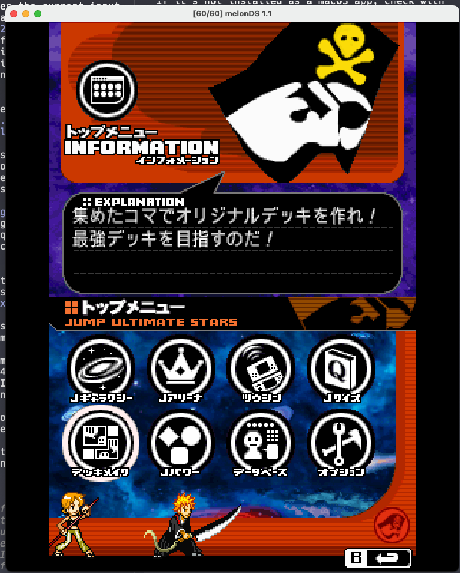
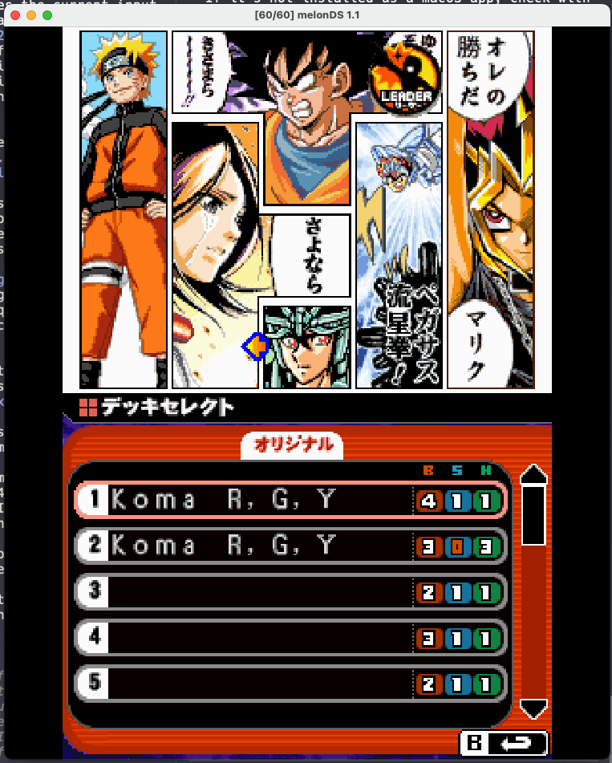
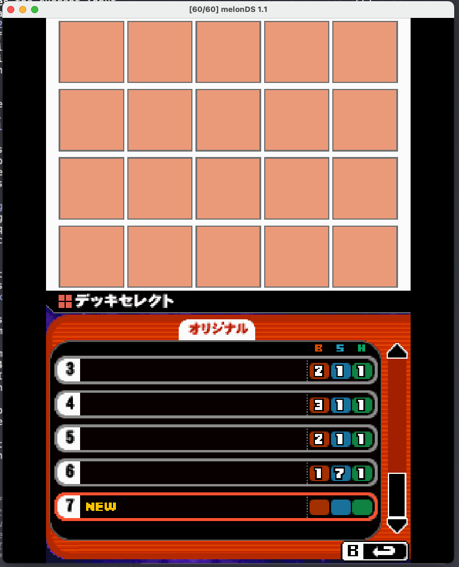
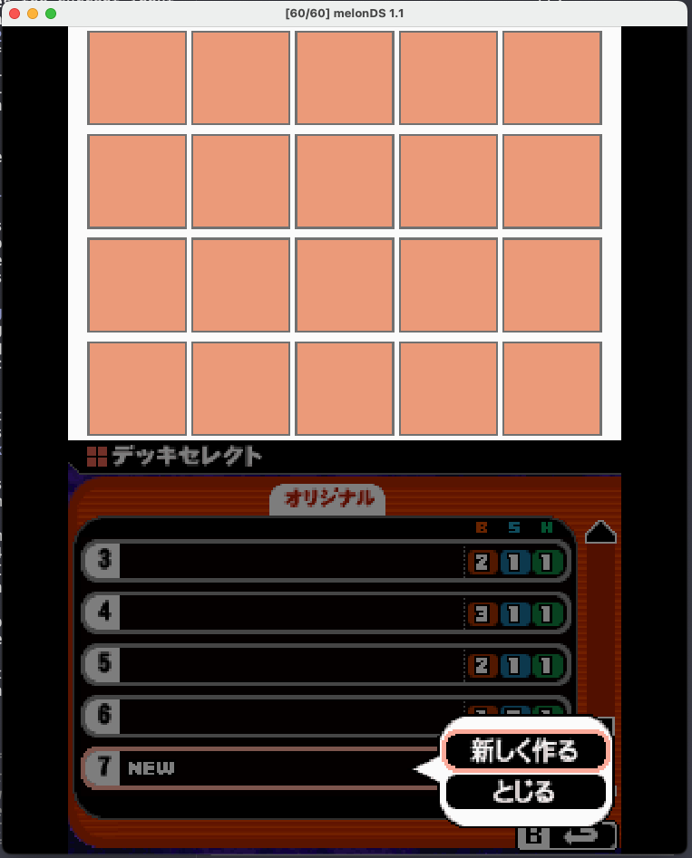
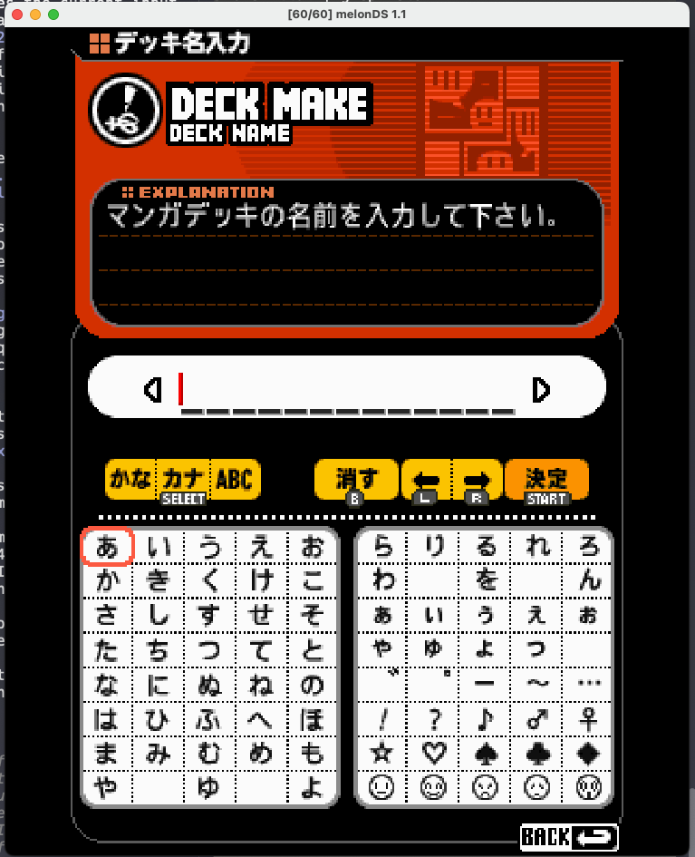
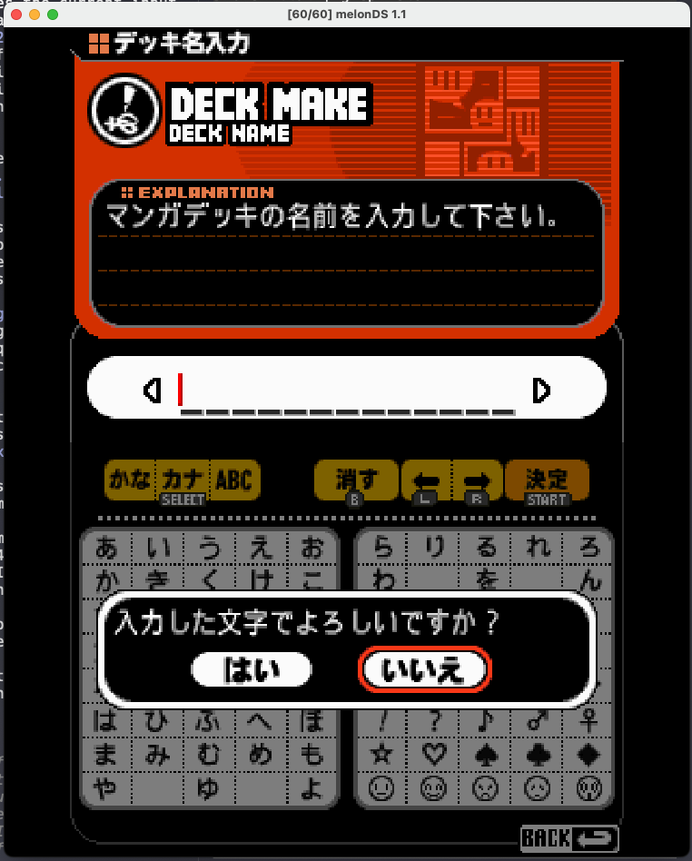
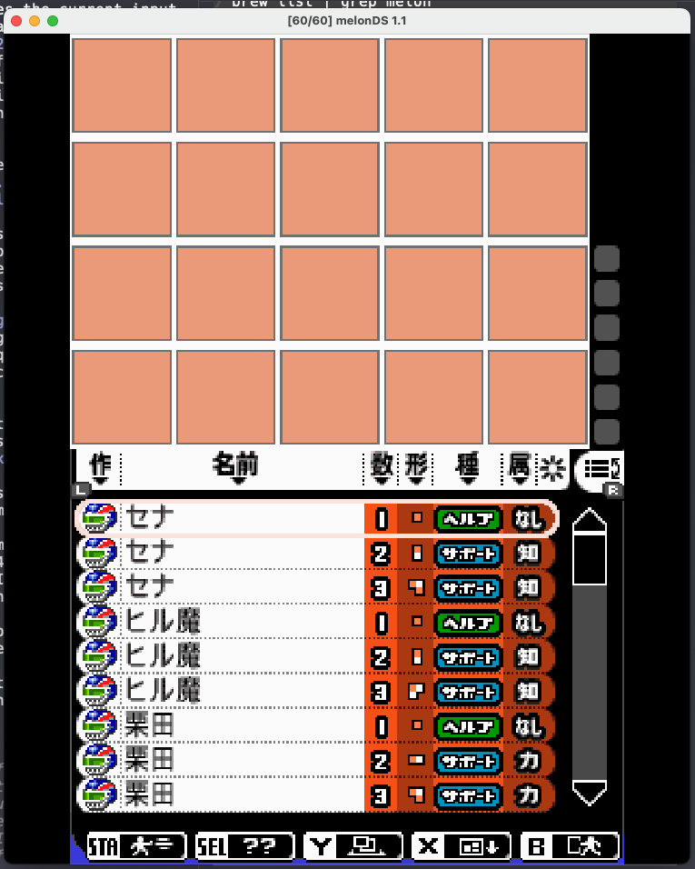
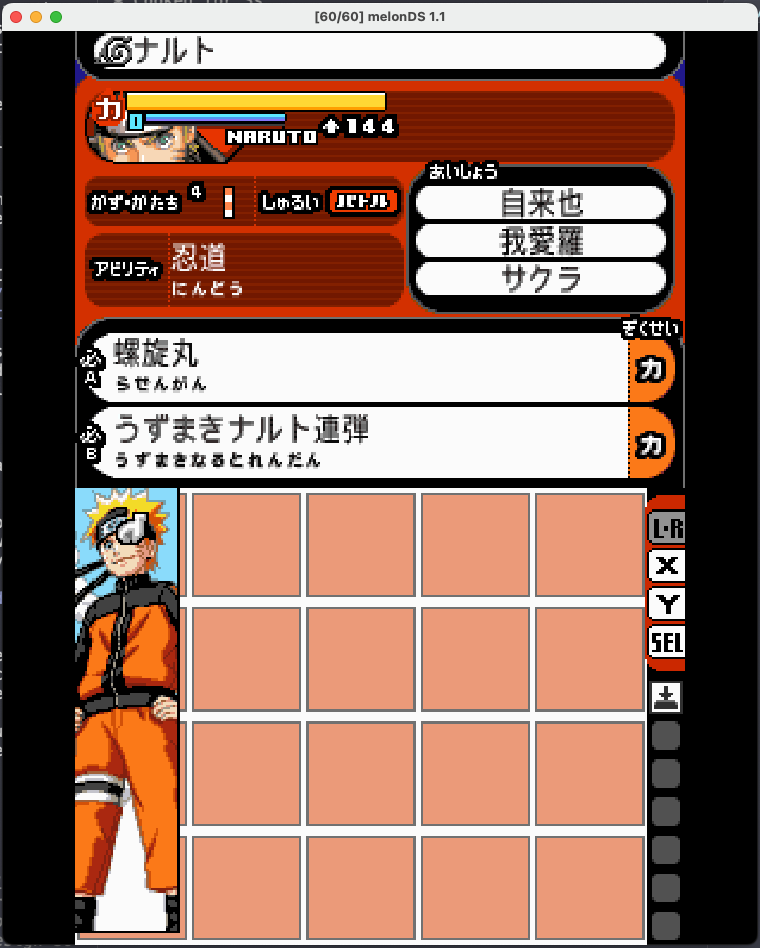
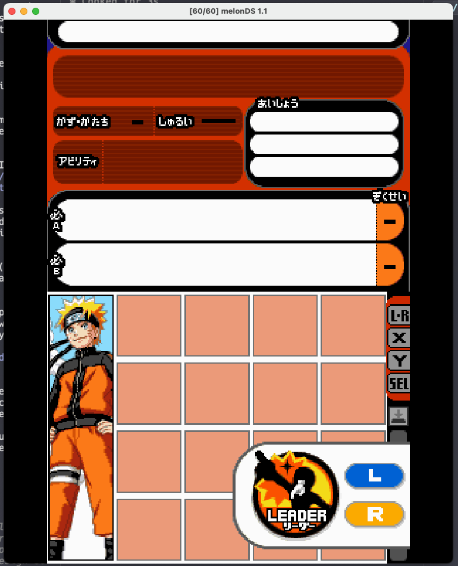
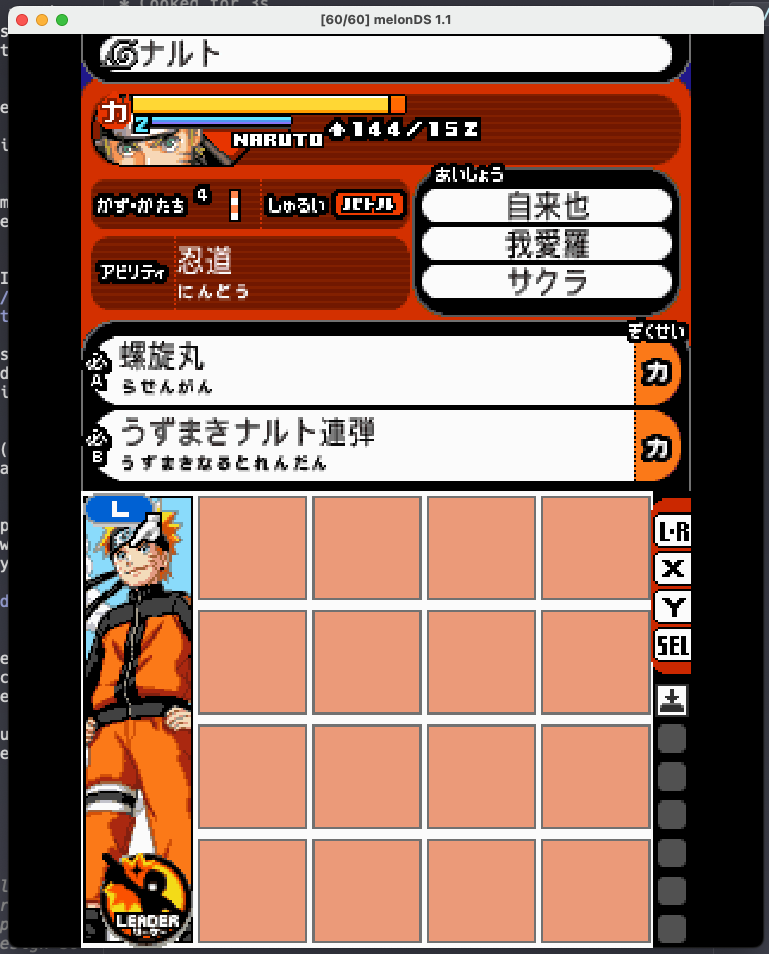

# Koma Deckbuilder — UX Spec for Recreation

Source: live play session on melonDS 1.1, 25 annotated screenshots, walked by the project owner. Everything here is **observed** — seen on screen, not inferred from disassembly. Strongest evidence tier, but it's behavior, not data layout. Where a number might be an artifact of one save file, it says so.

Companion doc: `docs/research/Koma-System-Observed-Behavior.md` (same facts, aimed at static-RE).

## What this system is

Jump Ultimate Stars is a platform fighter where you build a **manga page** instead of picking a character. The deck is a 4×5 grid of comic panels ("koma"). Each panel is a character at a certain size, and size determines role. A 1-panel Naruto is a passive buff. A 4-panel Naruto is a playable fighter. An 8-panel Naruto is a stronger fighter that eats 8 of your 20 cells.

The core tension: **grid space is the currency.** No mana, no point cost — panels cost exactly their own area. A deck is a packing puzzle where every tetromino is also a gameplay decision.

## Screen flow

Two NDS screens. Which screen owns the grid changes as you go — that's the most important structural thing to get right.

1. **Main menu** → bottom-left icon (デッキメイク / "Deck Make").  Top screen shows an INFORMATION panel explaining the mode.
2. **Deck select** (デッキセレクト).   Bottom screen lists deck slots 1–N; observed up to 7 with a `NEW` row, and RAM work in `Deck-Memory-Structure.md` says 8 slots (index 0–7 at `0x020AFEB4`). Each row shows the deck's name plus three counters under **B / S / H** — battle, support, helper panel counts. Top screen previews the selected deck as a manga page.
3. Choosing `NEW` opens a popup: 新しく作る (create new) / とじる (close). 
4. **Name entry** (デッキ名入力). Modes かな / カナ / ABC toggled with SELECT. B = delete, L/R = move cursor, START = 決定 (confirm). **Blank names are allowed.** Confirm raises a はい/いいえ dialog.  
5. **Deck edit.** Grid on top screen, panel browser on bottom. 

Every popup has an explicit とじる ("close") button rather than relying on B. Copy that — it's a touch-first design.

## Deck edit screen — the core

### Top screen (initially)
The 4×5 grid, empty cells as flat salmon/peach squares. A vertical strip of button hints sits to the right.

### Bottom screen
A scrolling list of every unlocked panel. One row per panel — a character appears once *per size they own*:

| Column | Content |
|---|---|
| Series icon | Small per-manga emblem (leftmost) |
| Name | Character name (セナ, ヒル魔, ナルト, …) |
| Size | Digit 1–8 |
| Shape | Tiny pictogram of the panel's footprint |
| Type | Colored pill — バトル red / サポート blue / ヘルプア green |
| Nature | 力 / 知 / 笑 / なし |

That row is the whole data model made visible. Build this first.

### Filter bar (top of bottom screen)
Seven items, left to right. L jumps to the first; each is tappable.

| Glyph | Filter | Options observed |
|---|---|---|
| 作 | Series | Grid of ~40 series emblems; selecting one shows its name (e.g. アイシールド２１) ([shot](../research/assets/koma-ui/08-filter-series.png)) |
| 名前 | Phonetic | Gojūon rows: あ か さ た な / は ま や ら わ ([shot](../research/assets/koma-ui/09-filter-phonetic.png)) |
| 数 | Size | 1–8 ([shot](../research/assets/koma-ui/10-filter-size.png)) |
| 形 | Shape | **Two-stage**: pick size 1–8 first (L/R to move), then shapes for that size ([shot](../research/assets/koma-ui/11-filter-shape-size5.png)) |
| 種 | Type | バトル / サポート / ヘルプア ([shot](../research/assets/koma-ui/12-filter-type.png)) |
| 属 | Nature | 力 / 知 / 笑 / なし ([shot](../research/assets/koma-ui/13-filter-nature.png)) |
| 米 | Reset | Clears all filters |

The two-stage shape filter is a real design choice — shape is only meaningful once you've fixed the size.

### Bottom button bar
Maps to hardware buttons but every item is tappable:

- **START** — drops into training mode to test the current deck. In-place playtesting, no menu round-trip.
- **SELECT** — toggles "tips" mode; tapping anything explains it instead of doing it.
- **Y** — cycles the **top screen** through four views (below).
- **X** — moves the grid *down* to the bottom screen for touch rearrangement.
- **B** — exit editing.

### The four Y views

1. **Grid** — default. ([shot](../research/assets/koma-ui/14-view1-grid-naruto-list.png))
2. **Panel info** — portrait, HP bar with number, size + shape, type pill, ability name, and an あいしょう ("compatibility") box listing **3 related characters**. Only battle panels fill this in fully; helpers and supports show dashes. ([battle](../research/assets/koma-ui/15-view2-panelinfo-battle.png), [helper](../research/assets/koma-ui/16-view2-panelinfo-helper.png), [support](../research/assets/koma-ui/17-view2-panelinfo-support.png))
3. **Ability text** — full descriptions. Helpers get one passive block. Supports get one ability block. Battle panels get passive + two specials (A and B), each tagged with its own nature. ([shot](../research/assets/koma-ui/18-view3-ability-text-battle.png))
4. **Preview** — large panel art, plus the in-game **sprite** for battle characters. ([shot](../research/assets/koma-ui/19-view4-preview-sprite.png))

Worth stealing: views 2 and 3 are the same object at two zoom levels. The player flips between them with one button while the cursor stays put.

## Placement

1. Select a row (tap or press A). The grid slides to the bottom screen and the panel attaches to a **hand cursor**. 
2. Move the hand. **D-pad moves one cell at a time; touchscreen jumps anywhere.** Support both — d-pad for precision, touch for speed.
3. Place it.

### Stickers
A vertical **L·R** strip on the right of the edit screen. Tap to pick up a sticker — **Leader**, **L**, or **R** — then place it on a panel: 

- **Leader** — battle panels only. This is who you start the match as.
- **L / R** — battle *or* support panels. Binds the panel to that shoulder button: character swap for battle, calling in assists for supports.

Observed: placing the L sticker on the 4-koma Naruto changed his HP from `144` to `144/152`. The second number appearing only after sticker placement is suggestive but not understood — flag as open. 

### Helper directions
Most 1-cell helper panels need a **facing** set after placement. Three states, worth reproducing exactly because it teaches the mechanic:

1. **Held** — panel follows the hand cursor. ([shot](../research/assets/koma-ui/23-helper-held.png))
2. **Dropped, awaiting direction** — panel sits in its cell, four orange arrows fan out up/down/left/right, rest of the grid dims. ([shot](../research/assets/koma-ui/24-helper-awaiting-direction.png))
3. **Set** — one arrow remains, showing the chosen facing. ([shot](../research/assets/koma-ui/25-helper-direction-set.png))

Direction presumably aims the helper's passive at part of the grid. The mechanical effect is not yet known.

### Rules
- **A legal deck needs at least one of each type**: battle, support, and helper.
- Panels can't overlap; a panel occupies exactly its shape's cells.

## Natures and the type triangle

Four values: **力 Power**, **知 Knowledge**, **笑 Laughter**, **なし Neutral**.

The three real natures form a rock-paper-scissors loop:

```
Power  ──beats──▶  Knowledge  ──beats──▶  Laughter  ──beats──▶  Power
```

Neutral sits outside the triangle. **Every 1-cell helper observed had なし** — natures appear to start at size 2. A character can exist at the *same size* in two different natures: Naruto has both a 4-koma Power and a 4-koma Laughter, with different shapes and abilities. That's the cleanest lever the system has, and the single best test case for data decoding.

## Relationships (あいしょう)

Every battle character has exactly **3** related characters — sometimes same-series, sometimes cross-series when they share a theme. Place a related character **adjacent** to that battle panel and the game plays a chime with a sparkle on the battle panel. The payoff is **extra HP** in battle. The project owner recalls the internal name being something like "j soul" — a lead for string searching, not a confirmed identifier.

Adjacency is a third optimization axis on top of size and shape. A deck is being optimized for area, legality, *and* neighbor pairs at once.

## Reference panel set: Naruto

Read straight off the browser. Any recreation or data decode should reproduce this exactly:

| Size | Type | Nature | Note |
|---|---|---|---|
| 1 | ヘルプア Helper | なし | |
| 2 | サポート Support | 笑 | ability ハーレムの術 |
| 3 | サポート Support | 力 | |
| 4 | バトル Battle | 力 | vertical bar shape; passive 忍道, specials 螺旋丸 / うずまきナルト連弾 |
| 4 | バトル Battle | 笑 | same size, different shape and nature |
| 5 | バトル Battle | 力 | |
| 6 | バトル Battle | 力 | |
| 7 | バトル Battle | 力 | ナルト（九尾）— Nine-Tails, a distinct name |
| 8 | バトル Battle | 力 | ナルト（九尾） |

Source shot: [Naruto panel list](../research/assets/koma-ui/14-view1-grid-naruto-list.png)

The size-7 and size-8 panels are named ナルト（九尾）— a separate character label. Size can change identity, not just power.

Naruto's three relationships: 自来也 (Jiraiya), 我愛羅 (Gaara), サクラ (Sakura).

## Recreation checklist

Ordered by how much each teaches you about the system:

1. The browser row — series / name / size / shape / type / nature. Everything else hangs off it.
2. The 4×5 grid with correct polyomino placement and overlap rejection.
3. Hand cursor with dual d-pad/touch movement.
4. Screen ownership: grid moves top↔bottom on X and on panel pickup.
5. The six filters, with shape's two-stage size-then-shape flow.
6. Y's four-view cycle.
7. Helper direction-setting as its own three-state interaction.
8. Stickers (Leader / L / R) with their type restrictions.
9. Relationship adjacency detection with chime + sparkle feedback.
10. Deck legality: ≥1 battle, ≥1 support, ≥1 helper.

## Open questions

- What helper **direction** actually affects.
- The nature triangle's **magnitude** — how much does Power-over-Knowledge give you?
- The relationship HP bonus value, and whether all 3 relationships stack.
- What `144/152` means on the HP readout after sticker placement.
- Deck-level nature bonuses: older notes in `Deck-System.md` mention "+1 SP helpers affect the whole deck" and nature-based deck bonuses, but no formula was ever found.
- Whether unlock state gates shapes as well as characters and sizes.
